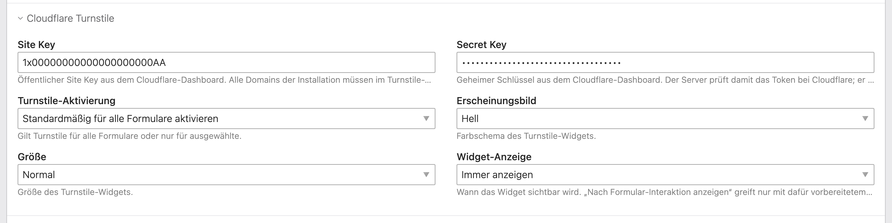
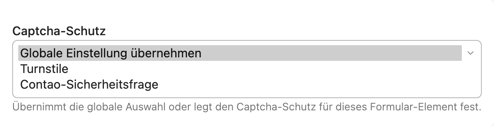
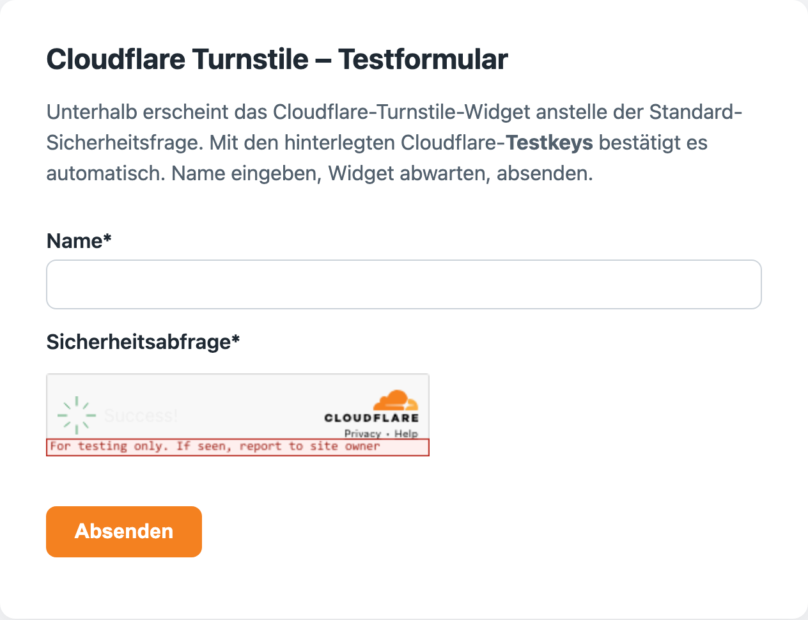

# Contao Cloudflare Turnstile


[Deutsch](README.md) | **English**

Globally replaces Contao's default CAPTCHA (the security question) with
[Cloudflare Turnstile](https://www.cloudflare.com/products/turnstile/). Keys are entered in the
Contao back end under **Settings** – no YAML or `.env` editing required.

A single code base for **Contao 4.13 LTS and Contao 5.3+** (incl. 5.4–5.7).

---

## Screenshots

Keys, theme, size and appearance are entered in the **Contao back end** under *system settings*:



Each form element can override the **captcha protection** (use global setting / Turnstile / Contao security question):



The **Turnstile widget** replaces the default security question in the front-end form (shown here with Cloudflare test keys):



---

## How it works

The bundle overrides the captcha field type (`$GLOBALS['TL_FFL']['captcha']`), so Turnstile
replaces the security question everywhere Contao resolves a captcha through the field-type
registry:

| Surface | Turnstile active? |
|---|---|
| Form generator (form **with** a captcha field) | ✅ yes |
| Member registration | ✅ yes |
| Comments | ✅ yes |
| Native newsletter subscription | ⚠️ version-dependent (see „Known limitations") |

**Important:** the bundle replaces the captcha **where a captcha field already exists**. It does
**not** add a captcha to forms that don't have one – add a captcha/security-question field as usual
and it becomes Turnstile automatically.

With **no keys** configured, Contao falls back automatically and losslessly to the default
security question.

**Turnstile activation (global) + per-field control:** under *Settings → Cloudflare Turnstile* the
**Turnstile activation** decides where Turnstile applies:

- **Enable for all forms by default** – default: active everywhere, can be turned off per field.
- **Enable only for selected forms** – only where chosen per field.
- **Disable everywhere** – the Contao security question everywhere (keys stay stored).

Each captcha field in the form generator additionally offers **Captcha protection** with
**Use global setting / Turnstile / Contao security question** to override the global default for that
single field – handy e.g. for forms in the **footer / on every page**.

## Installation

### A) Contao Manager (recommended)

1. In the Contao Manager under **Packages**, click **Add package** and search for `turnstile`
   (or `mandrael/contao-turnstile`).
2. **Add** it, then **Apply changes** – the Manager installs the extension via Composer.
3. Afterwards **update the database** (confirm the Manager's migration step) – this creates the new field.

### B) Terminal (without GUI)

```bash
composer require mandrael/contao-turnstile
vendor/bin/contao-console cache:clear
vendor/bin/contao-console contao:migrate
```

## Setup

1. Create a Turnstile widget in the
   [Cloudflare dashboard](https://dash.cloudflare.com/?to=/:account/turnstile) and copy the
   **site key** and **secret key**.
2. Add **all domains/hostnames** of the Contao installation to the Turnstile widget
   (e.g. `example.com`, `www.example.com`, any subdomains). If a domain is missing, verification
   fails on that domain.
3. In Contao under **Settings → Cloudflare Turnstile** enter the site key and secret key,
   optionally choose theme/size/appearance. The **theme** defaults to **light** (white) – switch to
   **dark** only if desired, **auto** follows the system colour scheme (the device's light/dark mode,
   not the page).

### Content Security Policy (CSP)

If you run a Content Security Policy, allow the Cloudflare host:

```
script-src https://challenges.cloudflare.com;
frame-src  https://challenges.cloudflare.com;
```

The widget uses the official external `api.js` and **no** inline JavaScript – no
`nonce`/`unsafe-inline` is required.

## Failure behaviour

- **Network/timeout errors** (Cloudflare unreachable, 5 s timeout) → the submission is **allowed**
  (fail-open) and an error is written to the Contao system log, so a Cloudflare outage does not
  bring down all forms.
- **Invalid/forged token** (`success: false`) → the submission is **blocked** (fail-closed). This
  also covers a wrong or expired site/secret key – then all forms block until the keys are fixed
  (a corresponding warning is written to the system log).

The secret key and internal data are never written to the log.

## Why Turnstile instead of ALTCHA?

Since 5.4/5.5 Contao ships ALTCHA, its own proof-of-work captcha. Turnstile is a Cloudflare-backed
alternative (risk signals instead of pure in-browser computation) and makes sense for operators
already using Cloudflare. Both exist side by side as separate field types; this bundle does not
touch ALTCHA.

## Known limitations

- **Native newsletter subscription:** version-dependent. Newer Contao 5 versions resolve the
  newsletter captcha via the field-type registry (verified on 5.7) – there Turnstile applies
  **automatically**. On **Contao 4.13 and 5.3** the captcha is hardcoded to `FormCaptcha` in the
  core; there the default security question remains (no loss of function). The newsletter module
  also has its own core option to disable the captcha.
- **Non-native surfaces** (third-party newsletter iframes, chat widgets) are intentionally out of
  scope.

## Compatibility

- **PHP:** 8.1+
- **Contao:** three LTS versions – **4.13 LTS, 5.3 LTS and 5.7 LTS** (incl. the intermediate 5.4–5.6) – from a single shared code base.
- **Tested** on a real instance each: **Contao 4.13 / PHP 8.1**, **Contao 5.3 / PHP 8.3** and
  **Contao 5.7 / PHP 8.4** – each with the active CAPTCHA override, back-end fields and correct
  rendering and fallback. Only Contao 6.0 (removal of the legacy template engine) will require an
  upgrade of this bundle.

## Technical quality features

**Robustness**

- **Automatic token refresh:** The Cloudflare widget stays in the DOM; tokens are refreshed automatically when they expire. The form therefore remains reliably submittable even when filled in slowly or resubmitted after a validation error.
- **Declarative rendering, no inline JavaScript:** Only Cloudflare's official external `api.js` is loaded. This is CSP-friendly (no `nonce`/`unsafe-inline` required); on Contao 5 the Cloudflare host is added to the Content Security Policy automatically.
- **Unique template name:** The front-end template uses a unique name and therefore does not collide with templates from other extensions or existing project templates.
- **Lossless configuration fallback:** With no keys configured, Turnstile globally disabled, or deselected per field, the field automatically uses Contao's default security question – no loss of function.
- **Differentiated failure behaviour:** *fail-open* only on transport/timeout errors when communicating with Cloudflare, *fail-closed* on an invalid token. The secret key is never written to the log.

**Handling of the keys**

- **Secret stays server-side:** The secret key is used solely on the server for verification and is never delivered to the browser.
- **Does not trigger password managers:** The secret field uses `type="text"` with CSS masking (`-webkit-text-security`) instead of `type="password"`. Browsers and password managers therefore do not recognise it as a login field and offer neither saving nor autofill – while the field stays visually masked. The last characters of the stored secret are shown discreetly for verification.

**Compatibility & quality**

- **Three Contao LTS versions from one code base:** Contao 4.13 LTS, 5.3 LTS and 5.7 LTS (including the intermediate 5.x releases), PHP 8.1+ – verified under real conditions on 4.13, 5.3 and 5.7.
- **Clean install and uninstall:** no `runonce`/install scripts, no writes to the project file system; back-end fields are provided via the DCA (and removed with the bundle), the database column via `contao:migrate`.
- **Convenient key management** directly in the back end – no YAML or `.env` editing required.
- **Fine-grained control:** global activation mode (everywhere / only selected forms / off) plus per-field override.
- **Tested and maintained:** PHPUnit, PHPStan (level 5), CI across PHP 8.1–8.4; MIT license; adds no tracking whatsoever.

## Trademark notice

Cloudflare and Turnstile are trademarks of Cloudflare, Inc. This extension is an independent,
open-source project and is not affiliated with, endorsed or sponsored by Cloudflare, Inc. The
bundled icon (`logo.svg`) is original artwork and is not the Cloudflare logo.

## License

MIT – see [LICENSE](LICENSE).
