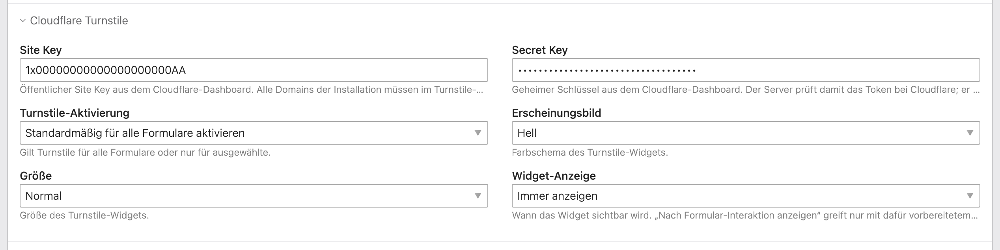
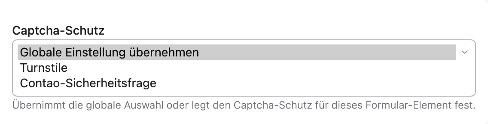
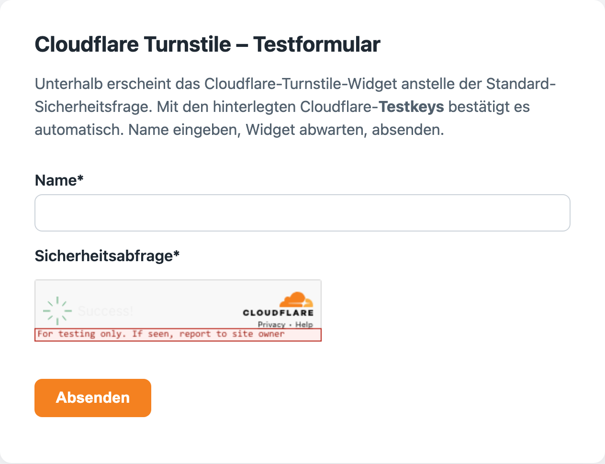

# Contao Cloudflare Turnstile


**Deutsch** | [English](README.en.md)

Ersetzt das Standard-CAPTCHA von Contao (die Sicherheitsfrage) global durch
[Cloudflare Turnstile](https://www.cloudflare.com/products/turnstile/). Die Keys werden
bequem im Contao-Backend unter **Einstellungen** eingetragen – keine YAML- oder
`.env`-Bearbeitung nötig.

Eine einzige Codebasis für die drei Contao-LTS-Versionen **4.13, 5.3 und 5.7** (inkl. 5.4–5.6).

---

## Screenshots

Keys, Erscheinungsbild, Größe und Widget-Anzeige werden im **Contao-Backend** unter *Systemeinstellungen* eingetragen:



Pro Formular-Element lässt sich der **Captcha-Schutz** überschreiben (globale Vorgabe / Turnstile / Contao-Sicherheitsfrage):



Das **Turnstile-Widget** ersetzt die Standard-Sicherheitsfrage im Frontend-Formular (hier mit Cloudflare-Testkeys):



---

## Funktionsweise

Das Bundle überschreibt den Captcha-Feldtyp (`$GLOBALS['TL_FFL']['captcha']`). Dadurch wird
überall dort, wo Contao ein Captcha über die Feldtyp-Registry auflöst, automatisch Turnstile
statt der Sicherheitsfrage angezeigt:

| Oberfläche | Turnstile aktiv? |
|---|---|
| Formulargenerator (Formular **mit** Captcha-Feld) | ✅ ja |
| Mitglieder-Registrierung | ✅ ja |
| Kommentare | ✅ ja |
| Native Newsletter-Anmeldung | ⚠️ versionsabhängig (siehe „Bekannte Grenzen") |

**Wichtig:** Das Bundle ersetzt das Captcha **dort, wo bereits ein Captcha-Feld vorhanden ist**.
Es fügt Formularen ohne Captcha **kein** Turnstile hinzu. Um ein Formular zu schützen, fügt man
ihm wie gewohnt ein Captcha-/Sicherheitsfrage-Feld hinzu – dieses ist dann automatisch Turnstile.

Sind **keine Keys** hinterlegt, fällt Contao automatisch und verlustfrei auf die
Standard-Sicherheitsfrage zurück.

**Turnstile-Aktivierung (global) + Per-Feld-Steuerung:** Unter *Einstellungen → Cloudflare Turnstile*
legt die **Turnstile-Aktivierung** fest, wo Turnstile greift:

- **Standardmäßig für alle Formulare aktivieren** – Standard: überall aktiv, pro Feld abwählbar.
- **Nur bei ausgewählten Formularen aktivieren** – nur dort, wo es pro Feld gewählt wird.
- **Überall deaktivieren** – überall die Contao-Sicherheitsfrage (Keys bleiben gespeichert).

Jedes Captcha-Feld im Formulargenerator hat zusätzlich den **Captcha-Schutz** mit
**Globale Einstellung übernehmen / Turnstile / Contao-Sicherheitsfrage**, um die globale Vorgabe für
dieses eine Feld zu überschreiben – praktisch z. B. für Formulare in der **Fußzeile / auf jeder Seite**.

## Installation

### A) Contao Manager (empfohlen)

1. Im Contao Manager unter **Pakete** auf **Paket hinzufügen** klicken und nach `turnstile`
   (bzw. `mandrael/contao-turnstile`) suchen.
2. Mit **Hinzufügen** auswählen, dann **Änderungen übernehmen** – der Manager installiert die
   Erweiterung per Composer.
3. Danach die **Datenbank aktualisieren** (Manager-Schritt bestätigen) – legt das neue Feld an.

### B) Terminal (ohne GUI)

```bash
composer require mandrael/contao-turnstile
vendor/bin/contao-console cache:clear
vendor/bin/contao-console contao:migrate
```

## Einrichtung

1. Im [Cloudflare-Dashboard](https://dash.cloudflare.com/?to=/:account/turnstile) ein
   Turnstile-Widget anlegen und **Site Key** + **Secret Key** kopieren.
2. **Alle Domains/Hostnames** der Contao-Installation im Turnstile-Widget hinterlegen
   (z. B. `example.com`, `www.example.com`, ggf. Subdomains). Fehlt eine Domain, schlägt die
   Überprüfung auf dieser Domain fehl.
3. In Contao unter **Einstellungen → Cloudflare Turnstile** Site Key und Secret Key eintragen,
   optional Erscheinungsbild/Größe/Widget-Anzeige wählen. Das **Erscheinungsbild** ist standardmäßig **Hell**
   (weiß) – auf **Dunkel** nur bei Bedarf umstellen, **Auto** passt sich dem System-Farbmodus an
   (Hell-/Dunkelmodus des Geräts, nicht der Seite).

### Content Security Policy (CSP)

Wird auf der Seite eine CSP eingesetzt, muss der Cloudflare-Host erlaubt sein:

```
script-src https://challenges.cloudflare.com;
frame-src  https://challenges.cloudflare.com;
```

Das Widget nutzt das offizielle, externe `api.js` und **kein** Inline-JavaScript – eine
`nonce`/`unsafe-inline` ist nicht erforderlich.

Im **ALTCHA-Fallback** (`turnstileFailureMode = altcha`, ab 0.7.0) kommen same-origin-Quellen dazu:

```
script-src  'self';
worker-src  'self';
connect-src 'self';
```

Unter Contao 5 trägt das Bundle diese im `altcha`-Modus automatisch ein; unter Contao 4.13 (keine CSP-API)
ergänzt sie ein Integrator mit eigener strikter CSP selbst.

## Verhalten ohne gültiges Token

- **Netzwerk-/Timeout-Fehler** (Cloudflare nicht erreichbar, 5 s Timeout) → die Prüfung gilt als
  fehlgeschlagen (fail-closed) und ein Fehler wird ins Contao-System-Log geschrieben.
- **Ungültiges/gefälschtes Token** (`success: false`) → ebenfalls fehlgeschlagen. Dazu zählt auch ein
  falscher oder abgelaufener Site/Secret Key (eine entsprechende Warnung landet im System-Log).
- **Modus `block`** (Standard) → jede fehlgeschlagene Prüfung weist das Formular ab.
- **Modus `altcha`** (empfohlen für Anmelde-, Buchungs- und Kontaktformulare) → niemand wird allein
  wegen eines Turnstile-Fehlalarms abgewiesen. Zuerst eine mechanische Prüfung: verstecktes Feld,
  signierter Zeitstempel, Mindestzeit von 3 Sekunden, eine im Browser gelöste Rechenaufgabe (ALTCHA).
  Sie kann weiterhin abweisen, etwa ohne JavaScript; die Meldung nennt dann einen Ausweg. Wer sie
  besteht, dessen Einsendung wird angenommen und eingestuft:
  - Inhaltssignale: Zeichensalat in Textfeldern (ein Feld, das nur aus einem Zufallswort ab 16 Groß- und
    Kleinbuchstaben besteht, wie `KqWbTzeHuRNmoPLxa`, oder Silbenketten wie „qexira vubot lomeza" ohne gängige Funktionswörter),
    Link oder Auszeichnung im Text, derselbe Text aus mehreren Netzen binnen 24 Stunden.
  - Adresssignale: punktzerstückelte Mailadresse (bei Gmail ab vier Punkten und drei
    Einzelzeichen, etwa `q.w.er.t.zu.7@gmail.com`; sonst ab sechs Punkten und vier Einzelzeichen), Domain ohne MX-Eintrag.
  - Herkunftssignal: Die Einsendung kommt von einem Tor-Ausgangsknoten. Die Liste lädt das Bundle von
    `check.torproject.org` (ohne Nutzerdaten, 6 Stunden gecacht; bei Fehler kein Treffer).
  - Nur Zusatzpunkte, nie allein ausreichend: mehr als fünf tokenlose Einsendungen aus einem Netz
    binnen einer Stunde (hinter einem Reverse-Proxy nur mit korrekt gesetzten `trusted_proxies`).
  - **„Spam sicher"** bei mindestens 7 Punkten **und** Signalen aus mindestens zwei der drei Gruppen
    Inhalt, Adresse, Tor. Tor wiegt schwer: Dazu genügt ein deutliches Signal aus Inhalt oder Adresse (Zeichensalat in
    mehreren Feldern, punktzerstückelte Adresse, Wiederholung); Tor mit nur einem Link oder fehlendem MX-Eintrag bleibt
    Graubereich. Dann geht keine Mail der Einsendung hinaus; alle landen in der **Spam-Ablage** (siehe unten).
    Registrierung: Die Mail an die registrierte Adresse (Aktivierung) geht trotzdem hinaus, damit ein Mensch im
    Fehlalarm nicht ausgesperrt ist; die übrigen Mails landen in der Ablage. Kommentare: unveröffentlicht, ohne
    Mail an Abonnenten.
  - Sonst läuft alles normal, einschließlich Bestätigung an den Absender. Im Formulargenerator und bei
    Kommentaren gehen höchstens drei Mails je eingetragener Adresse und Tag hinaus.
- **Optionale KI-Einordnung** für den Graubereich (zwei Gruppen vertreten, aber nicht „Spam
  sicher“): `TURNSTILE_AI_KEY` in `.env.local`, `TURNSTILE_AI_PROVIDER` (`mistral` oder
  `anthropic`), wahlweise `TURNSTILE_AI_MODEL`. Ist sie eingerichtet, führt dort auch ein sicheres
  KI-Urteil zu „Spam sicher"; jedes andere Urteil zur normalen Verarbeitung; Fehler, Zeitüberschreitung (5 s) und das Tagesbudget (150) führen zur normalen
  Verarbeitung. Übermittelt werden nur Textfelder und Mailadresse, nie die IP; der Anbieter gehört als
  Auftragsverarbeiter in die Datenschutzerklärung.

### Spam-Ablage

Backend unter **System → Spam-Ablage**: Liste der als „Spam sicher" eingestuften Einsendungen mit Datum,
Quelle, Punkten, Signalen und Betreff. Die Einzelansicht zeigt die zurückgehaltenen Mails samt Empfängern;
**„Doch zustellen"** verschickt sie nachträglich unverändert, einschließlich Anhängen. Ist der Ausgang eines
Versands unklar (etwa nach einem Abbruch), bietet die Ansicht erst nach 15 Minuten ein erneutes Senden an, mit
Hinweis auf mögliche Doppelzustellung.

- Einträge werden nach **90 Tagen** automatisch gelöscht (täglicher Cronjob).
- Ungeprüfte Einträge meldet eine Systemnachricht auf der Backend-Startseite.
- **Tageszusammenfassung** (Einstellungen, Standard aus): eine Mail je Tag mit Datum, Quelle, Punkten,
  Signalen und Betreff der neuen Einträge, ohne Inhalt der Einsendung. Empfänger ist die eingetragene Adresse,
  sonst die Administrator-Adresse.
- Scheitert das Ablegen (etwa Datenbankfehler oder Mail über 12 MB), geht die Mail ersatzweise mit `[Spam]` im
  Betreff an die Betreiber, nie an die im Formular eingetragene Adresse. Eine verlorene Einsendung wiegt schwerer
  als eine Spam-Mail im Fehlerfall.
- Die Ablage enthält personenbezogene Daten der Einsendung; sie gehört mit 90 Tagen Speicherdauer in die
  Datenschutzerklärung.

Secret Key und interne Daten werden niemals ins Log geschrieben. Formularinhalte auch nicht; die
Einstufung protokolliert nur Punkte und Signalnamen (`fallback-pass`, `fallback-spam`).

## Warum Turnstile statt ALTCHA?

Contao bringt seit 5.4/5.5 mit ALTCHA ein eigenes, Proof-of-Work-basiertes Captcha mit. Turnstile
ist eine Cloudflare-gestützte Alternative (Risiko-Signale statt reiner Rechenarbeit im Browser)
und für Betreiber sinnvoll, die ohnehin Cloudflare nutzen. Beide existieren als getrennte
Feldtypen nebeneinander; Contaos **eigenen** ALTCHA-Feldtyp berührt dieses Bundle nicht.

Seit **0.7.0** kann Turnstile optional auf eine **selbst gerechnete** ALTCHA-Proof-of-Work-Aufgabe als
Fallback zurückgreifen (`turnstileFailureMode = altcha`), seit **0.8.0** mit anschließender Einstufung – unabhängig
von Contaos internem, ab 5.4 verfügbarem ALTCHA und daher auf 4.13 wie 5.x identisch. Details siehe
[`UPGRADE.md`](UPGRADE.md).

## Bekannte Grenzen

- **Native Newsletter-Anmeldung:** versionsabhängig. Neuere Contao-5-Versionen lösen das
  Newsletter-Captcha über die Feldtyp-Registry auf (verifiziert in 5.7) – dort greift Turnstile
  **automatisch** mit. Auf **Contao 4.13 und 5.3** ist das Captcha im Core fest auf `FormCaptcha`
  verdrahtet; dort bleibt die Standard-Sicherheitsfrage (kein Funktionsverlust). Das Newsletter-Modul
  hat zudem eine eigene Core-Option „Captcha deaktivieren".
- **Spam-Ablage:** Löschung und Tageszusammenfassung laufen über den Contao-Cron; er muss regelmäßig ausgelöst werden
  (Cronjob oder Besucheraufrufe). Die Zustellprotokolle des Notification Centers zeigen abgelegte Mails als versendet.
  Mails, die erst in einem Hintergrundprozess entstehen, werden nicht eingestuft.

### Template-Overrides

Wer `templates/form_mandrael_turnstile.html5` überschreibt, sollte den eigenen Override nach
einem Update gegen das Bundle-Template abgleichen: Beim Rendern prüft das Bundle, ob im
erzeugten HTML alle Pflichtfelder (u. a. `data-sitekey`, die Cloudflare-Attribute je Feld-ID
sowie – bei aktivem ALTCHA-Fallback – `data-challengeurl`/`data-workerurl`) enthalten sind.
Fehlt etwas, steht höchstens einmal je Stunde ein Fehler der Kategorie `template-outdated` im
System-Log; die Ausgabe selbst bleibt unverändert. Die genaue Liste der Pflichtmarker steht in
[`UPGRADE.md`](UPGRADE.md). Der ALTCHA-Solver meldet eigene Fehler zusätzlich per
`console.warn` in der Browser-Konsole.

## Kompatibilität

- **PHP:** 8.1+
- **Contao:** drei LTS-Versionen – **4.13 LTS, 5.3 LTS und 5.7 LTS** (inkl. der dazwischenliegenden 5.4–5.6) – aus einer gemeinsamen Codebasis.
- **Getestet** auf je einer echten Instanz: **Contao 4.13 / PHP 8.1**, **Contao 5.3 / PHP 8.3**
  und **Contao 5.7 / PHP 8.4** – jeweils mit aktivem CAPTCHA-Override, Backend-Feldern und
  korrektem Rendering bzw. Fallback. Erst Contao 6.0 (Entfernung der Legacy-Template-Engine)
  erfordert ein Upgrade dieses Bundles.

## Technische Qualitätsmerkmale

**Robustheit**

- **Automatische Token-Erneuerung:** Das Cloudflare-Widget bleibt im DOM eingebunden; Tokens werden bei Ablauf automatisch erneuert. So bleibt das Formular auch bei längerer Ausfülldauer und beim erneuten Absenden nach einem Validierungsfehler zuverlässig absendbar.
- **Deklaratives Rendering ohne Inline-JavaScript:** Es wird ausschließlich das offizielle externe `api.js` von Cloudflare eingebunden. Das ist CSP-freundlich (keine `nonce`/`unsafe-inline` erforderlich); unter Contao 5 wird der Cloudflare-Host automatisch zur Content-Security-Policy hinzugefügt.
- **Eindeutiger Template-Name:** Das Frontend-Template trägt einen eindeutigen Namen und kollidiert daher nicht mit Templates anderer Erweiterungen oder vorhandenen Projekt-Templates.
- **Verlustfreier Konfigurations-Fallback:** Sind keine Keys hinterlegt, ist Turnstile global deaktiviert oder pro Feld abgewählt, verwendet das Feld automatisch die Standard-Sicherheitsfrage von Contao – kein Funktionsverlust.
- **Fail-closed bei jedem Fehler:** Transport-/Timeout-Fehler in der Kommunikation mit Cloudflare und ein ungültiges Token führen beide zu einer fehlgeschlagenen Prüfung; danach entscheidet der gewählte Modus (`block` oder `altcha`). Der Secret Key wird zu keinem Zeitpunkt protokolliert.

**Umgang mit den Schlüsseln**

- **Secret bleibt serverseitig:** Der geheime Schlüssel wird ausschließlich serverseitig zur Prüfung verwendet und nicht an den Browser ausgeliefert.
- **Triggert keine Passwortmanager:** Das Secret-Feld nutzt `type="text"` mit CSS-Maskierung (`-webkit-text-security`) statt `type="password"`. Dadurch erkennen Browser und Passwortmanager es nicht als Anmeldefeld und bieten weder Speichern noch automatisches Ausfüllen an – das Feld bleibt dabei optisch maskiert. Zur Kontrolle werden die letzten Zeichen des gespeicherten Secrets dezent eingeblendet.

**Kompatibilität & Qualität**

- **Drei Contao-LTS-Versionen aus einer Codebasis:** Contao 4.13 LTS, 5.3 LTS und 5.7 LTS (inkl. der dazwischenliegenden 5.x-Releases), PHP 8.1+ – auf 4.13, 5.3 und 5.7 unter realen Bedingungen verifiziert.
- **Rückstandsarme Installation und Deinstallation:** keine `runonce`-/Installationsskripte, keine Schreibzugriffe auf das Projekt-Dateisystem; Backend-Felder werden über die DCA bereitgestellt (und mit dem Bundle wieder entfernt), die Datenbankspalten und die zwei Tabellen der Spam-Ablage über `contao:migrate`.
- **Komfortable Schlüsselverwaltung** direkt im Backend – ohne YAML- oder `.env`-Bearbeitung.
- **Feingranulare Steuerung:** globaler Aktivierungsmodus (überall / nur ausgewählte Formulare / aus) plus Überschreibung je Formular-Element.
- **Getestet und gepflegt:** PHPUnit, PHPStan (Level 5), CI über PHP 8.1–8.4; MIT-Lizenz; fügt keinerlei Tracking hinzu.

## Markenrechtlicher Hinweis

Cloudflare und Turnstile sind Marken der Cloudflare, Inc. Diese Erweiterung ist ein
unabhängiges, quelloffenes Projekt und steht in keiner Verbindung zu Cloudflare, Inc.; sie wird
von dieser weder unterstützt noch gesponsert. Das mitgelieferte Icon (`logo.svg`) ist eine eigene
Grafik und nicht das Cloudflare-Logo.

## Lizenz

MIT – siehe [LICENSE](LICENSE).
